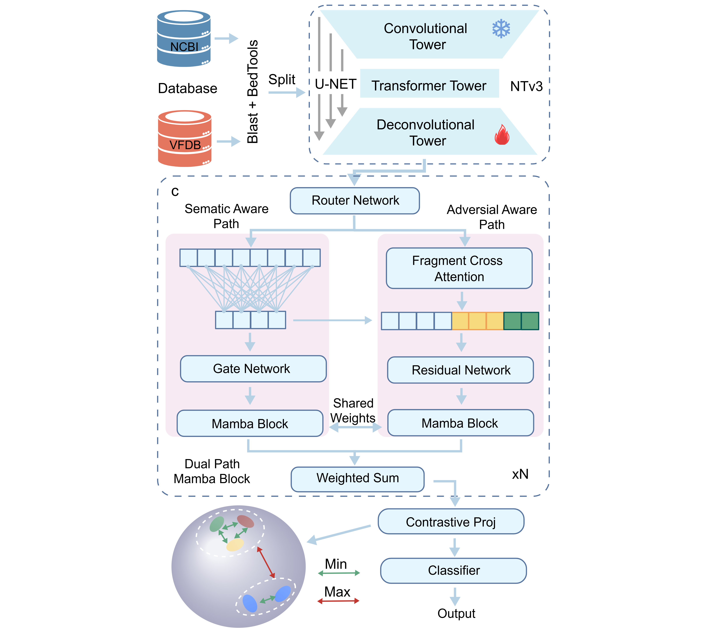

---

# SecureMamba

**Robust Biosafety Screening via Functional Semantic Reconstruction**

A Dual-Path Mamba Block-based framework that detects malicious biosequences **even after heavy obfuscation, fragmentation, and rearrangement**.

---

## Table of Contents

1. [Overview](#overview)
2. [Key Features](#key-features)
3. [Performance Highlights](#performance-highlights)
4. [Architecture](#architecture)
5. [Applications](#applications)
6. [Visualization Analysis](#visualization-analysis)
7. [Requirements](#requirements)
8. [Data Availability](#data-availability)
9. [Model Weights](#model-weights)
10. [Installation](#installation)
11. [Configuration](#configuration)
12. [Running](#running)
13. [Prediction](#prediction)
14. [Output Files](#output-files)
15. [Project Structure](#project-structure)
16. [FAQ](#faq)
17. [License](#license)

---

## Overview

Traditional screening fails against AI-modified pathogens.  
SecureMamba upgrades detection from **syntactic matching** to **functional semantic understanding** for synthetic biology & DNA storage safety.



---

## Key Features

- 🧬 **Anti-obfuscation**: Resists mutations, fragmentation, reverse-complementation
- 🧠 **Dual-Path Mamba**: Semantic perception + adversarial perception
- 🌍 **Universal**: Cross-species toxin detection with shared toxicity grammar
- 📦 **DNA-Storage Ready**: Low false-positive, high-throughput, robust in high-entropy environments
- 🔬 **Interpretable**: Anchors directly to conserved functional domains

---

## Performance Highlights

- **0.97** accuracy on virulence sequences
- **0.98** on obfuscated variants
- **0.82** cross-species toxin detection
- **0.14** false-positive rate in DNA storage

---

## Architecture

```
NT-V3 → Dual-Path Mamba Block → Contrastive Learning → Classifier
```

---

## Applications

- DNA synthesis safety screening
- High-throughput synthetic biology monitoring
- Secure DNA data storage
- Cross-species toxin & pathogen detection

---

## Visualization Analysis

We can analyze the important regions identified by the model through gradient attribution analysis methods to gain deeper biological significance and model rationality.

Simply run the `attribution_analysis.py` script to obtain visualization results. The specific steps are shown in the video below.

[VEDIO](https://vimeo.com/1197582288?share=copy&fl=sv&fe=ci)

---

## Requirements

| Component | Version |
|-----------|---------|
| Python | 3.11.6 |
| PyTorch | 2.5.1+cu121 |
| CUDA | 12.1 |

### Core Dependencies

```bash
# Name                    Version                   Build  Channel
_openmp_mutex             4.5                  4_kmp_llvm    conda-forge
accelerate                1.11.0                   pypi_0    pypi
aiohappyeyeballs          2.6.1                    pypi_0    pypi
aiohttp                   3.13.2                   pypi_0    pypi
aiosignal                 1.4.0                    pypi_0    pypi
alsa-lib                  1.2.8                h166bdaf_0    conda-forge
anyio                     4.11.0                   pypi_0    pypi
aom                       3.5.0                h27087fc_0    conda-forge
attr                      2.5.2                h39aace5_0    conda-forge
attrs                     25.4.0                   pypi_0    pypi
biopython                 1.85            py311h49ec1c0_2    conda-forge
blas                      2.116                       mkl    conda-forge
blas-devel                3.9.0            16_linux64_mkl    conda-forge
blosc2                    3.11.1                   pypi_0    pypi
brotli                    1.1.0                hb03c661_4    conda-forge
brotli-bin                1.1.0                hb03c661_4    conda-forge
brotli-python             1.1.0           py311h1ddb823_4    conda-forge
bzip2                     1.0.8                h4bc722e_7    conda-forge
ca-certificates           2025.11.12           hbd8a1cb_0    conda-forge
cairo                     1.16.0            ha61ee94_1012    conda-forge
causal-conv1d             1.5.3.post1              pypi_0    pypi
certifi                   2025.11.12         pyhd8ed1ab_0    conda-forge
cffi                      1.17.1          py311h5b438cf_1    conda-forge
charset-normalizer        3.4.3              pyhd8ed1ab_0    conda-forge
colorama                  0.4.6              pyhd8ed1ab_1    conda-forge
contourpy                 1.3.3           py311hdf67eae_2    conda-forge
cpython                   3.11.13         py311hd8ed1ab_0    conda-forge
cuda-cudart               11.8.89                       0    nvidia
cuda-cupti                11.8.87                       0    nvidia
cuda-libraries            11.8.0                        0    nvidia
cuda-nvrtc                11.8.89                       0    nvidia
cuda-nvtx                 11.8.86                       0    nvidia
cuda-runtime              11.8.0                        0    nvidia
cuda-version              12.9                          3    nvidia
cycler                    0.12.1             pyhd8ed1ab_1    conda-forge
datasets                  4.4.1                    pypi_0    pypi
dbus                      1.13.6               h5008d03_3    conda-forge
dill                      0.4.0                    pypi_0    pypi
einops                    0.8.1                    pypi_0    pypi
expat                     2.7.1                hecca717_0    conda-forge
ffmpeg                    5.1.2           gpl_h8dda1f0_106    conda-forge
fftw                      3.3.10          nompi_hf1063bd_110    conda-forge
filelock                  3.19.1             pyhd8ed1ab_0    conda-forge
font-ttf-dejavu-sans-mono 2.37                 hab24e00_0    conda-forge
font-ttf-inconsolata      3.000                h77eed37_0    conda-forge
font-ttf-source-code-pro  2.038                h77eed37_0    conda-forge
font-ttf-ubuntu           0.83                 h77eed37_3    conda-forge
fontconfig                2.14.2               h14ed4e7_0    conda-forge
fonts-conda-ecosystem     1                             0    conda-forge
fonts-conda-forge         1                             0    conda-forge
fonttools                 4.59.2          py311h3778330_0    conda-forge
freetype                  2.12.1               h267a509_2    conda-forge
frozenlist                1.8.0                    pypi_0    pypi
fsspec                    2025.9.0                 pypi_0    pypi
gettext                   0.25.1               h3f43e3d_1    conda-forge
gettext-tools             0.25.1               h3f43e3d_1    conda-forge
glib                      2.80.2               hf974151_0    conda-forge
glib-tools                2.80.2               hb6ce0ca_0    conda-forge
gmp                       6.3.0                hac33072_2    conda-forge
gmpy2                     2.2.1           py311h92a432a_1    conda-forge
gnutls                    3.7.9                hb077bed_0    conda-forge
graphite2                 1.3.14               hecca717_2    conda-forge
gst-plugins-base          1.22.0               h4243ec0_2    conda-forge
gstreamer                 1.22.0               h25f0c4b_2    conda-forge
gstreamer-orc             0.4.41               h17648ed_0    conda-forge
h11                       0.16.0                   pypi_0    pypi
h2                        4.3.0              pyhcf101f3_0    conda-forge
h5py                      3.15.1                   pypi_0    pypi
harfbuzz                  6.0.0                h8e241bc_0    conda-forge
hf-xet                    1.1.9                    pypi_0    pypi
hpack                     4.1.0              pyhd8ed1ab_0    conda-forge
httpcore                  1.0.9                    pypi_0    pypi
httpx                     0.28.1                   pypi_0    pypi
huggingface-hub           0.36.0                   pypi_0    pypi
hyperframe                6.1.0              pyhd8ed1ab_0    conda-forge
icu                       70.1                 h27087fc_0    conda-forge
idna                      3.10               pyhd8ed1ab_1    conda-forge
jack                      1.9.22               h11f4161_0    conda-forge
jinja2                    3.1.6              pyhd8ed1ab_0    conda-forge
joblib                    1.5.2              pyhd8ed1ab_0    conda-forge
jpeg                      9e                   h166bdaf_2    conda-forge
keyutils                  1.6.3                hb9d3cd8_0    conda-forge
kiwisolver                1.4.9           py311h724c32c_1    conda-forge
krb5                      1.20.1               h81ceb04_0    conda-forge
lame                      3.100             h166bdaf_1003    conda-forge
lcms2                     2.15                 hfd0df8a_0    conda-forge
ld_impl_linux-64          2.44                 h1423503_1    conda-forge
lerc                      4.0.0                h0aef613_1    conda-forge
libasprintf               0.25.1               h3f43e3d_1    conda-forge
libasprintf-devel         0.25.1               h3f43e3d_1    conda-forge
libblas                   3.9.0            16_linux64_mkl    conda-forge
libbrotlicommon           1.1.0                hb03c661_4    conda-forge
libbrotlidec              1.1.0                hb03c661_4    conda-forge
libbrotlienc              1.1.0                hb03c661_4    conda-forge
libcap                    2.67                 he9d0100_0    conda-forge
libcblas                  3.9.0            16_linux64_mkl    conda-forge
libclang                  15.0.7          default_h127d8a8_5    conda-forge
libclang13                15.0.7          default_h5d6823c_5    conda-forge
libcublas                 11.11.3.6                     0    nvidia
libcufft                  10.9.0.58                     0    nvidia
libcufile                 1.14.1.1                      4    nvidia
libcups                   2.3.3                h36d4200_3    conda-forge
libcurand                 10.3.10.19                    0    nvidia
libcusolver               11.4.1.48                     0    nvidia
libcusparse               11.7.5.86                     0    nvidia
libdb                     6.2.32               h9c3ff4c_0    conda-forge
libdeflate                1.17                 h0b41bf4_0    conda-forge
libdrm                    2.4.125              hb03c661_1    conda-forge
libedit                   3.1.20250104    pl5321h7949ede_0    conda-forge
libevent                  2.1.10               h28343ad_4    conda-forge
libexpat                  2.7.1                hecca717_0    conda-forge
libffi                    3.4.6                h2dba641_1    conda-forge
libflac                   1.4.3                h59595ed_0    conda-forge
libgcc                    15.1.0               h767d61c_4    conda-forge
libgcc-ng                 15.1.0               h69a702a_4    conda-forge
libgcrypt                 1.11.1               ha770c72_0    conda-forge
libgcrypt-devel           1.11.1               hb9d3cd8_0    conda-forge
libgcrypt-lib             1.11.1               hb9d3cd8_0    conda-forge
libgcrypt-tools           1.11.1               hb9d3cd8_0    conda-forge
libgettextpo              0.25.1               h3f43e3d_1    conda-forge
libgettextpo-devel        0.25.1               h3f43e3d_1    conda-forge
libgfortran               15.1.0               h69a702a_4    conda-forge
libgfortran-ng            15.1.0               h69a702a_4    conda-forge
libgfortran5              15.1.0               hcea5267_4    conda-forge
libglib                   2.80.2               hf974151_0    conda-forge
libgpg-error              1.55                 h3f2d84a_0    conda-forge
libhwloc                  2.9.1                hd6dc26d_0    conda-forge
libiconv                  1.18                 h3b78370_2    conda-forge
libidn2                   2.3.8                ha4ef2c3_0    conda-forge
libjpeg-turbo             2.0.0                h9bf148f_0    pytorch
liblapack                 3.9.0            16_linux64_mkl    conda-forge
liblapacke                3.9.0            16_linux64_mkl    conda-forge
libllvm15                 15.0.7               hadd5161_1    conda-forge
libltdl                   2.4.3a               h5888daf_0    conda-forge
liblzma                   5.8.1                hb9d3cd8_2    conda-forge
liblzma-devel             5.8.1                hb9d3cd8_2    conda-forge
libnpp                    11.8.0.86                     0    nvidia
libnsl                    2.0.1                hb9d3cd8_1    conda-forge
libnvjpeg                 11.9.0.86                     0    nvidia
libogg                    1.3.5                hd0c01bc_1    conda-forge
libopus                   1.5.2                hd0c01bc_0    conda-forge
libpciaccess              0.18                 hb9d3cd8_0    conda-forge
libpng                    1.6.43               h2797004_0    conda-forge
libpq                     15.3                 hbcd7760_1    conda-forge
libsndfile                1.2.2                hc60ed4a_1    conda-forge
libsqlite                 3.46.0               hde9e2c9_0    conda-forge
libstdcxx                 15.1.0               h8f9b012_4    conda-forge
libstdcxx-ng              15.1.0               h4852527_4    conda-forge
libsystemd0               253                  h8c4010b_1    conda-forge
libtasn1                  4.20.0               hb9d3cd8_0    conda-forge
libtiff                   4.5.0                h6adf6a1_2    conda-forge
libtool                   2.5.4                h5888daf_0    conda-forge
libudev1                  253                  h0b41bf4_1    conda-forge
libunistring              0.9.10               h7f98852_0    conda-forge
libuuid                   2.38.1               h0b41bf4_0    conda-forge
libva                     2.18.0               h0b41bf4_0    conda-forge
libvorbis                 1.3.7                h54a6638_2    conda-forge
libvpx                    1.11.0               h9c3ff4c_3    conda-forge
libwebp-base              1.6.0                hd42ef1d_0    conda-forge
libxcb                    1.13              h7f98852_1004    conda-forge
libxcrypt                 4.4.36               hd590300_1    conda-forge
libxkbcommon              1.5.0                h79f4944_1    conda-forge
libxml2                   2.10.3               hca2bb57_4    conda-forge
libzlib                   1.3.1                hb9d3cd8_2    conda-forge
lion-pytorch              0.2.3                    pypi_0    pypi
llvm-openmp               15.0.7               h0cdce71_0    conda-forge
llvmlite                  0.44.0          py311h1741904_2    conda-forge
lmdb                      1.7.5                    pypi_0    pypi
lz4-c                     1.9.4                hcb278e6_0    conda-forge
mamba-ssm                 2.2.6.post3              pypi_0    pypi
markupsafe                3.0.2           py311h2dc5d0c_1    conda-forge
matplotlib                3.9.1           py311h38be061_1    conda-forge
matplotlib-base           3.9.1           py311h74b4f7c_2    conda-forge
mkl                       2022.1.0           h84fe81f_915    conda-forge
mkl-devel                 2022.1.0           ha770c72_916    conda-forge
mkl-include               2022.1.0           h84fe81f_915    conda-forge
mpc                       1.3.1                h24ddda3_1    conda-forge
mpfr                      4.2.1                h90cbb55_3    conda-forge
mpg123                    1.32.9               hc50e24c_0    conda-forge
mpmath                    1.3.0              pyhd8ed1ab_1    conda-forge
msgpack                   1.1.2                    pypi_0    pypi
msgpack-numpy             0.4.8                    pypi_0    pypi
multidict                 6.7.0                    pypi_0    pypi
multiprocess              0.70.18                  pypi_0    pypi
munkres                   1.1.4              pyhd8ed1ab_1    conda-forge
mysql-common              8.0.33               hf1915f5_6    conda-forge
mysql-libs                8.0.33               hca2cd23_6    conda-forge
ncurses                   6.5                  h2d0b736_3    conda-forge
ndindex                   1.10.1                   pypi_0    pypi
nettle                    3.9.1                h7ab15ed_0    conda-forge
networkx                  3.5                pyhe01879c_0    conda-forge
ninja                     1.11.1                   pypi_0    pypi
nspr                      4.37                 h29cc59b_0    conda-forge
nss                       3.100                hca3bf56_0    conda-forge
numba                     0.61.2          py311h9806782_1    conda-forge
numexpr                   2.14.1                   pypi_0    pypi
numpy                     2.2.6           py311h5d046bc_0    conda-forge
nvidia-cublas-cu12        12.1.3.1                 pypi_0    pypi
nvidia-cuda-cupti-cu12    12.1.105                 pypi_0    pypi
nvidia-cuda-nvrtc-cu12    12.1.105                 pypi_0    pypi
nvidia-cuda-runtime-cu12  12.1.105                 pypi_0    pypi
nvidia-cudnn-cu12         9.1.0.70                 pypi_0    pypi
nvidia-cufft-cu12         11.0.2.54                pypi_0    pypi
nvidia-curand-cu12        10.3.2.106               pypi_0    pypi
nvidia-cusolver-cu12      11.4.5.107               pypi_0    pypi
nvidia-cusparse-cu12      12.1.0.106               pypi_0    pypi
nvidia-nccl-cu12          2.21.5                   pypi_0    pypi
nvidia-nvjitlink-cu12     12.9.86                  pypi_0    pypi
nvidia-nvtx-cu12          12.1.105                 pypi_0    pypi
openh264                  2.3.1                hcb278e6_2    conda-forge
openjpeg                  2.5.0                hfec8fc6_2    conda-forge
openssl                   3.1.8                h7b32b05_0    conda-forge
p11-kit                   0.24.1               hc5aa10d_0    conda-forge
packaging                 23.2                     pypi_0    pypi
pandas                    2.3.2           py311hed34c8f_0    conda-forge
patsy                     1.0.1              pyhd8ed1ab_1    conda-forge
pcre2                     10.43                hcad00b1_0    conda-forge
pillow                    9.4.0           py311h50def17_1    conda-forge
pip                       25.2               pyh8b19718_0    conda-forge
pixman                    0.46.4               h54a6638_1    conda-forge
platformdirs              4.5.0                    pypi_0    pypi
ply                       3.11               pyhd8ed1ab_3    conda-forge
prokbert                  0.0.48                   pypi_0    pypi
propcache                 0.4.1                    pypi_0    pypi
psutil                    7.1.3                    pypi_0    pypi
pthread-stubs             0.4               hb9d3cd8_1002    conda-forge
pulseaudio                16.1                 hcb278e6_3    conda-forge
pulseaudio-client         16.1                 h5195f5e_3    conda-forge
pulseaudio-daemon         16.1                 ha8d29e2_3    conda-forge
py-cpuinfo                9.0.0                    pypi_0    pypi
pyarrow                   22.0.0                   pypi_0    pypi
pycparser                 2.22               pyh29332c3_1    conda-forge
pynndescent               0.5.13             pyhd8ed1ab_1    conda-forge
pyparsing                 3.2.3              pyhe01879c_2    conda-forge
pyqt                      5.15.9          py311hf0fb5b6_5    conda-forge
pyqt5-sip                 12.12.2         py311hb755f60_5    conda-forge
pysocks                   1.7.1              pyha55dd90_7    conda-forge
python                    3.11.6          hab00c5b_0_cpython    conda-forge
python-dateutil           2.9.0.post0        pyhe01879c_2    conda-forge
python-tzdata             2025.2             pyhd8ed1ab_0    conda-forge
python_abi                3.11                    8_cp311    conda-forge
pytorch-cuda              11.8                 h7e8668a_6    pytorch
pytorch-mutex             1.0                        cuda    pytorch
pytz                      2025.2             pyhd8ed1ab_0    conda-forge
pyyaml                    6.0.2           py311h2dc5d0c_2    conda-forge
qhull                     2020.2               h434a139_5    conda-forge
qt-main                   5.15.8               h5d23da1_6    conda-forge
readline                  8.2                  h8c095d6_2    conda-forge
regex                     2025.9.1                 pypi_0    pypi
requests                  2.32.5             pyhd8ed1ab_0    conda-forge
safetensors               0.6.2                    pypi_0    pypi
scikit-learn              1.7.1           py311hc3e1efb_0    conda-forge
scipy                     1.16.1          py311h1e13796_1    conda-forge
seaborn                   0.13.2               hd8ed1ab_3    conda-forge
seaborn-base              0.13.2             pyhd8ed1ab_3    conda-forge
setuptools                80.9.0             pyhff2d567_0    conda-forge
sip                       6.7.12          py311hb755f60_0    conda-forge
six                       1.17.0             pyhe01879c_1    conda-forge
sniffio                   1.3.1                    pypi_0    pypi
statsmodels               0.14.5          py311hb0beb2c_0    conda-forge
svt-av1                   1.4.1                hcb278e6_0    conda-forge
sympy                     1.13.1                   pypi_0    pypi
tables                    3.10.2                   pypi_0    pypi
tbb                       2021.9.0             hf52228f_0    conda-forge
threadpoolctl             3.6.0              pyhecae5ae_0    conda-forge
tk                        8.6.13          noxft_h4845f30_101    conda-forge
tokenizers                0.22.1                   pypi_0    pypi
toml                      0.10.2             pyhd8ed1ab_1    conda-forge
tomli                     2.2.1              pyhe01879c_2    conda-forge
torch                     2.5.1+cu121              pypi_0    pypi
torchaudio                2.5.1+cu121              pypi_0    pypi
torchvision               0.20.1+cu121             pypi_0    pypi
tornado                   6.5.2           py311h49ec1c0_1    conda-forge
tqdm                      4.67.1             pyhd8ed1ab_1    conda-forge
transformers              4.57.1                   pypi_0    pypi
triton                    3.1.0                    pypi_0    pypi
typing_extensions         4.15.0             pyhcf101f3_0    conda-forge
tzdata                    2025b                h78e105d_0    conda-forge
umap-learn                0.5.9.post2     py311h38be061_0    conda-forge
unicodedata2              16.0.0          py311h49ec1c0_1    conda-forge
urllib3                   2.5.0              pyhd8ed1ab_0    conda-forge
wheel                     0.45.1             pyhd8ed1ab_1    conda-forge
x264                      1!164.3095           h166bdaf_2    conda-forge
x265                      3.5                  h924138e_3    conda-forge
xcb-util                  0.4.0                h516909a_0    conda-forge
xcb-util-image            0.4.0                h166bdaf_0    conda-forge
xcb-util-keysyms          0.4.0                h516909a_0    conda-forge
xcb-util-renderutil       0.3.9                h166bdaf_0    conda-forge
xcb-util-wm               0.4.1                h516909a_0    conda-forge
xkeyboard-config          2.38                 h0b41bf4_0    conda-forge
xorg-fixesproto           5.0               hb9d3cd8_1003    conda-forge
xorg-kbproto              1.0.7             hb9d3cd8_1003    conda-forge
xorg-libice               1.1.2                hb9d3cd8_0    conda-forge
xorg-libsm                1.2.6                he73a12e_0    conda-forge
xorg-libx11               1.8.4                h0b41bf4_0    conda-forge
xorg-libxau               1.0.12               hb9d3cd8_0    conda-forge
xorg-libxdmcp             1.1.5                hb9d3cd8_0    conda-forge
xorg-libxext              1.3.4                h0b41bf4_2    conda-forge
xorg-libxfixes            5.0.3             h7f98852_1004    conda-forge
xorg-libxrender           0.9.10            h7f98852_1003    conda-forge
xorg-renderproto          0.11.1            hb9d3cd8_1003    conda-forge
xorg-xextproto            7.3.0             hb9d3cd8_1004    conda-forge
xorg-xproto               7.0.31            hb9d3cd8_1008    conda-forge
xxhash                    3.6.0                    pypi_0    pypi
xz                        5.8.1                hbcc6ac9_2    conda-forge
xz-gpl-tools              5.8.1                hbcc6ac9_2    conda-forge
xz-tools                  5.8.1                hb9d3cd8_2    conda-forge
yaml                      0.2.5                h280c20c_3    conda-forge
yarl                      1.22.0                   pypi_0    pypi
zlib                      1.3.1                hb9d3cd8_2    conda-forge
zstandard                 0.23.0          py311h49ec1c0_3    conda-forge
zstd                      1.5.6                ha6fb4c9_0    conda-forge
```

---

## Data Availability

The training and testing datasets used in SecureMamba are publicly available on Zenodo:

- **Dataset DOI (version v1)**: [10.5281/zenodo.20374288](https://doi.org/10.5281/zenodo.20374288)
- **Dataset DOI (all versions)**: [10.5281/zenodo.20374287](https://doi.org/10.5281/zenodo.20374287)

### Dataset Files

| File | Size | Description |
|------|------|-------------|
| `train_data_pos.fasta` | 52.8 MB | Positive training samples (toxic/virulent sequences) |
| `train_data_neg.fasta` | 192.1 MB | Negative training samples (non-toxic/benign sequences) |
| `btx_test.fasta` | 2.2 MB | BTXPred test set |
| `vfdb_test.fasta` | 16.9 MB | Virulence Factor Database (VFDB) test set |
| `toxin_test.fasta` | 9.2 MB | ToxinPred test set |

### Download Datasets

```bash
# Download using wget
wget https://zenodo.org/record/20374288/files/train_data_pos.fasta
wget https://zenodo.org/record/20374288/files/train_data_neg.fasta
wget https://zenodo.org/record/20374288/files/btx_test.fasta
wget https://zenodo.org/record/20374288/files/vfdb_test.fasta

# Create data directory and move files
mkdir -p train_data
mv *.fasta train_data/
```

---

## Model Weights

The pre-trained SecureMamba model weights are available on Zenodo:

- **Model DOI (version v1)**: [10.5281/zenodo.20365513](https://doi.org/10.5281/zenodo.20365513)

### Download Model

```bash
# Download model weights from Zenodo
wget https://zenodo.org/record/20365513/files/best_nucleotide_v3_mamba_model.pth
```

Place the downloaded model file in the project root directory or specify the path in prediction commands.

---

## Installation
[Installation Guide](./INSTALLATION.MD)
---
## Configuration

Edit `config.py` to adjust settings:

```python
# Data
positive_fasta = "train_data_pos.fasta"
negative_fasta = "train_data_neg.fasta"
max_seq_length = 2048
downsample_ratio = 3.0

# Model
transformer_model_repo = "InstaDeepAI/NTv3_8M_pre"
d_model = 256
n_layer = 2
block_type = "dual_path"

# Training
batch_size = 16
learning_rate = 2e-6
num_epochs = 20
use_amp = True
run_mode = "all"  # preprocess, generate, train, all, train-only
```

---

## Running

### Prepare Data

Place downloaded FASTA files in `train_data/`:
```
train_data/
├── train_data_pos.fasta          # Positive samples (52.8 MB)
├── train_data_neg.fasta          # Negative samples (192.1 MB)
├── btx_test.fasta                # Botulinum toxin test set (2.2 MB)
└── vfdb_test.fasta               # Virulence factor test set (16.9 MB)
```

### Run Pipeline

For the first run, you need to use the "all" mode to execute the full process. And change config.py:
```bash
 # ========== Data Configuration ==========
 positive_fasta = "train_data/train_data_pos.fasta"  # Positive samples file change to the actual file path
 negative_fasta = "train_data/train_data_neg.fasta"  # Negative samples file change to the actual file path
 # ========== Run Mode Configuration ==========
run_mode = "all"  # Run mode: "preprocess", "generate", "train", "all", "train-only"
 # ========== File Configuration ==========
use_existing_variants = False  # Whether to use existing variant file,  the first run must be set to False
variants_file_path = "results_nucleotide_v3_mamba/variants_data.pkl"  # Variant file path  change to the actual output directory
output_dir = "results_nucleotide_v3_mamba"  # Output directory change to the actual output directory
```

```bash
python main.py
```

### Run Modes

Set `run_mode` in `config.py`:

| Mode | Description |
|------|-------------|
| `preprocess` | FASTA → segments |
| `generate` | Generate semantic variants |
| `train` | Train model and validate(requires variants) |
| `all` | Full pipeline (preprocess->generate->train->validate) |

---

## Prediction

```bash
python predict.py --fasta input.fasta --model best_model.pth --threshold 0.5 --output-dir results
```

### Parameters

| Argument | Required | Description |
|----------|----------|-------------|
| `--fasta` | ✅ | Input FASTA file |
| `--model` | ✅ | Trained model (.pth) |
| `--threshold` | ❌ | Classification threshold (default: 0.5) |
| `--batch-size` | ❌ | Batch size (default: 8) |
| `--output-dir` | ❌ | Output directory |

### Example with Downloaded Model

```bash
python predict.py --fasta train_data/btx_test.fasta --model best_nucleotide_v3_mamba_model.pth --threshold 0.6 --output-dir ./results
```

---

## Output Files

### Training (`output_dir`)

| File | Description |
|------|-------------|
| `variants_data.pkl` | Generated variants |
| `best_nucleotide_v3_mamba_model.pth` | Best checkpoint |
| `nucleotide_v3_training_log.json` | Training log |

### Prediction (`output_dir`)

| File | Description |
|------|-------------|
| `predictions_threshold_{value}.csv` | Results table |
| `prediction_visualization_threshold_{value}.png` | Charts |
| `detailed_threshold_analysis.png` | Threshold analysis |

---

## Project Structure

```
├── config.py                       # Configuration parameters
├── main.py                         # Main training and validate entry point
├── predict.py                      # Predict script
├── model.py                        # NT-V3 + Dual-Path Mamba model definition
├── nucleotide_v3_trainable.py      # Trainable NT-V3 backbone wrapper
├── data_preprocessing.py           # FASTA loading and sequence segmentation
├── synonymous_variants.py          # Semantic variant generation
├── realtime_dataset.py             # Real-time dataset loading and batching
├── realtime_trainer.py             # Training loop and checkpointing
├── loss.py                         # Loss functions (contrastive + classification)
├── attribution_analysis.py         # Gradient attribution visualization
├── utils.py                        # Utility functions
├── Model/
    ├── best_nucleotide_v3_mamba_model.pth  # Model weights (download from Zenodo)
    └── NT-V3_Pre_8M                         #  NT-V3 Pre-train weights (download from Zenodo)
└── train_data/               # Training data (download from Zenodo)
    ├── train_data_pos.fasta
    ├── train_data_neg.fasta
    ├── btx_test.fasta
    ├── toxin_test.fasta
    └── vfdb_test.fasta
```

---

## FAQ

**CUDA out of memory?** Reduce `batch_size` and `max_seq_length`.

**Slow variant generation?** Increase `min_pos_base_diff` or reduce `max_semantic_attempts`.

**HF model download slow?** Add mirror:
```python
os.environ['HF_ENDPOINT'] = 'https://hf-mirror.com'
```

**Where to download datasets?** Zenodo DOI: [10.5281/zenodo.20374288](https://doi.org/10.5281/zenodo.20374288)

**Where to download model weights?** Zenodo DOI: [10.5281/zenodo.20365513](https://doi.org/10.5281/zenodo.20365513)

---

## License

MIT License

Copyright (c) 2026 kosha316

Permission is hereby granted, free of charge, to any person obtaining a copy
of this software and associated documentation files (the "Software"), to deal
in the Software without restriction, including without limitation the rights
to use, copy, modify, merge, publish, distribute, sublicense, and/or sell
copies of the Software, and to permit persons to whom the Software is
furnished to do so, subject to the following conditions:

The above copyright notice and this permission notice shall be included in all
copies or substantial portions of the Software.

THE SOFTWARE IS PROVIDED "AS IS", WITHOUT WARRANTY OF ANY KIND, EXPRESS OR
IMPLIED, INCLUDING BUT NOT LIMITED TO THE WARRANTIES OF MERCHANTABILITY,
FITNESS FOR A PARTICULAR PURPOSE AND NONINFRINGEMENT. IN NO EVENT SHALL THE
AUTHORS OR COPYRIGHT HOLDERS BE LIABLE FOR ANY CLAIM, DAMAGES OR OTHER
LIABILITY, WHETHER IN AN ACTION OF CONTRACT, TORT OR OTHERWISE, ARISING FROM,
OUT OF OR IN CONNECTION WITH THE SOFTWARE OR THE USE OR OTHER DEALINGS IN THE
SOFTWARE.

---

## Citation

If you use SecureMamba in your research, please cite:

```

---
